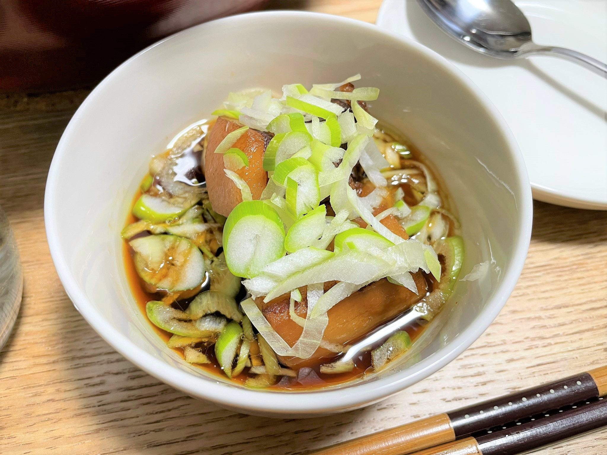
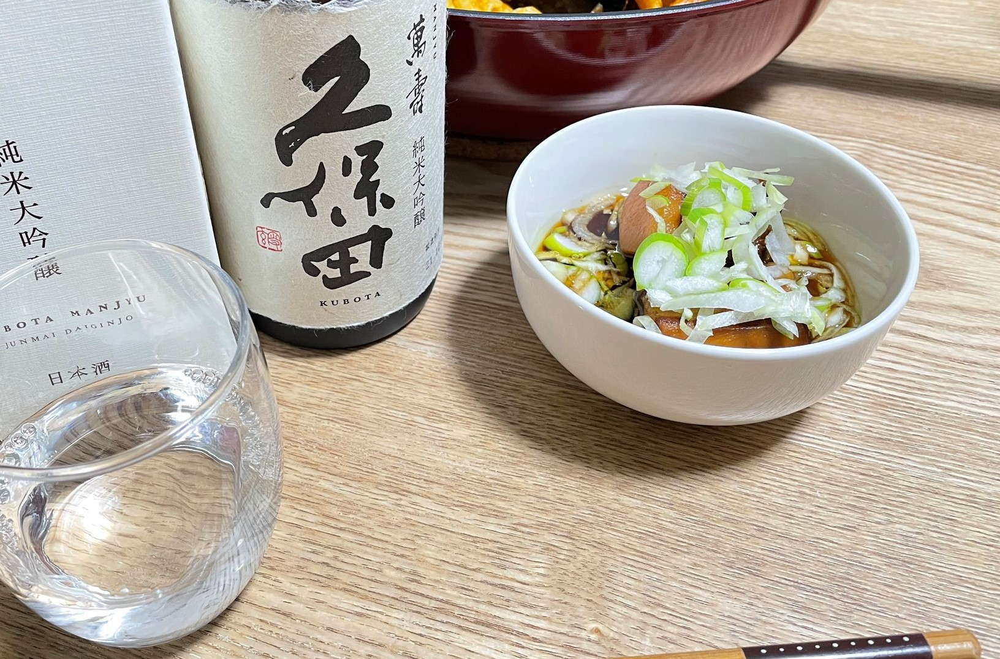

このドキュメントは、篠原氏おすすめの美味しい豚角煮のレシピになります。

# 下ごしらえ

今回は下ごしらえの必要はありません。

# 食材・調味料・調理器具

**器具**

- 包丁
- まな板
- 計量カップ
- フライパン
- 菜箸
- 炊飯器
- カレー用のスプーン

**食材**

- 豚バラブロック肉：300g-400g
- 長ネギ：1本
- ショウガ：2cmの円形ぐらい

※ネギは部分的に余ります  
※ショウガは薄切りにして使用します

**調味料**

- 醤油 75cc
- 料理酒/日本酒 75cc
- 本みりん 300cc

※1cc = 1mlです。  
※小さじ1は5ml、大さじ1は15mlです

**注意事項**

- 加熱器具にIHヒーターを使用する場合は、IH対応のフライパンを用意してください。
- 炊飯調理中は暇になります。
- 所要時間は3時間ぐらい

# 調理手順

この先は料理手順の解説です。分量と順をしっかり守ってください。  
めっちゃうまい角煮を味わえます

## 肉の準備

1. 肉を切ります。3cm各ぐらいで切ります。小さめよりは、大きめのほうが満足感が高いです。
1. 300gで6切れ、400gで8切れ程度になります。

## 肉を焼く

1. フライパンの予熱は不要です。
1. 切った肉をフライパンに並べます。脂身がフライパンの面に当たるように並べます。
1. 弱めの中火で焼いていきます。弱めの中火とは、フライパンの底にガスコンロの火が当たるぐらいです。
1. 蓋は必要ありません。弱めの火でじっくり焼き、肉から出た油で揚げ焼きにしていきます。
1. 片面1-2分ぐらい焼いていきます。焦げ目がついたら肉の向きを変え、すべての面を焼いていきます。

## 煮込み前の準備

以下の具材を使用します。

- ショウガ
- 長ネギの緑の部分

**手順**

1. 長ネギの濃い緑の部分を1本ぶん全部切ります。
1. 炊飯器に入る長さに切ります。
1. ショウガの皮は、スプーンを当てて引っ掻くようにこすると簡単に落とせます。
1. 半分にカットします。薄切りがラクになります。
1. カットした面を下にして、ショウガを2mm程度の厚さに切ります。薄くてもいいですが1mm以上は残します

## 煮込み（1回目）

ここから煮込みの手順です。  
得にカット等も入りません。また、火も使いません。空いた時間で洗濯や掃除などもできます

1. 炊飯器に、焼けた豚バラブロック肉を並べて入れます。なるべく重ならないように並べてください。向きはありません。
1. みりん300cc、水100ccを入れます。最大目盛りより0.5合ぐらい下に収まるようにしてください
1. 薄切りにしたショウガ、ネギを入れます。
1. 炊飯器の蓋を閉じ、炊飯ボタンを推します。モードは通常の炊飯でOKです。

## 煮込み（2回目）

1. ネギを取り出します。※醤油かけて食うとうまいです
1. 醤油 75cc、料理酒または日本酒75ccを加えます
1. 炊飯器の蓋を閉じ、再度炊飯ボタンを推します。

## 放置

2回目の炊飯のあと、保温で2時間放置します。
お疲れさまでした。美味しい角煮の完成です。

# アレンジレシピ

モツ煮に近いもつ鍋です。以下の調味料がよく合い、おすすめになります。

- かんずり（新潟県）
- かんずり6年（新潟県）
- おろしニンニクチューブ（パンチの効いた味に）
- 葱と生姜（瓶）スプーン1杯

おすすめの日本酒は以下のとおりです。

- 佐渡の北雪
- 久保田 千寿
- 真澄
- 浦霞

頂いた久保田 萬寿で食べたらとても美味しかった。

